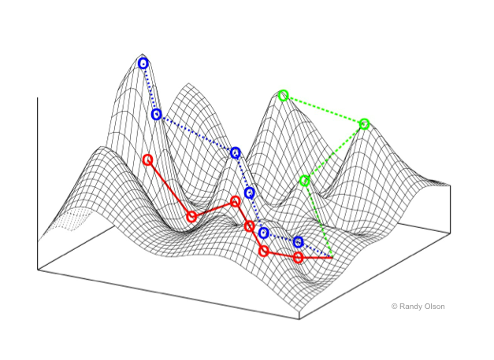

% The Evolution of Optimization Algorithms: A Story of Memory, CPU, and Ambition

<br clear=all>


## **Walking Through Optimization Landscapes: Ridges, Minima, and Maxima**

### **The Rabbits of the 1930s: The First Optimization Landscape**



In the 1930s, the famous geneticist **Sewall Wright** introduced a
metaphor that would shape our understanding of complex optimization
problems. Wright described a population of **rabbits** living on a
mountainous landscape. In this metaphor, the fitness of each rabbit
is determined by its position on the landscape—the higher up a hill
the rabbit is, the fitter it is. These hills represent **peaks in
fitness**, while the valleys represent **low fitness**.

This landscape wasn’t smooth, though. It was rugged, filled with
**ridges**, **local maxima**, and **local minima**—representing the
difficult nature of real-world optimization problems. Wright’s
“**fitness landscape**” was the first formal description of an
**optimization landscape**, and it introduced a powerful way of
visualizing how algorithms navigate complex spaces to find solutions.

Fast forward to today, optimization algorithms are those "rabbits"
traversing this landscape in search of the highest peak (the global
maximum) or lowest valley (the global minimum).


### **Understanding the Optimization Landscape**

In optimization, the landscape can be thought of as a surface where
each point represents a possible solution, and the height (or depth)
represents the value of the objective function you're optimizing—either
trying to minimize or maximize.

#### **Key Features of the Landscape:**

1. **Ridges:**
   - **Ridges** are like high mountain crests between peaks. In an optimization landscape, they are regions where moving in one direction improves the solution, but moving perpendicular to that direction yields little change.
   - Traversing ridges can be particularly tricky because it requires moving in a direction that leads to better solutions without being tempted by flat or shallow areas on either side.

2. **Local Minima:**
   - A **local minimum** is a point in the landscape where all neighboring points are higher (in terms of value for a minimization problem), but it is not necessarily the **global minimum**.
   - Local minima are common obstacles in optimization. Many algorithms, such as **Simulated Annealing**, must be designed to escape these traps to avoid getting stuck.

3. **Local Maxima:**
   - Similarly, a **local maximum** is a peak where all neighboring points are lower, but it is not the **global maximum**. Local maxima can trick algorithms into thinking they’ve found the best solution when there may be higher peaks elsewhere.

4. **Flat Regions:**
   - Flat regions or **plateaus** occur when there are large areas where the objective function does not change much. These regions make it hard for algorithms to discern which direction leads to improvement.

---

### **Navigating the Landscape: Challenges and Solutions**

1. **The Problem of Local Minima and Maxima:**
   Algorithms often find themselves stuck in **local minima** or **maxima**—a situation where no nearby solutions seem better, but better solutions exist elsewhere. For example, a rabbit may reach a small hill, think it’s on the highest peak, and stop searching—missing a nearby taller mountain.

   **Solution:**
   - **Simulated Annealing (SA)** is designed to avoid this trap by occasionally accepting worse solutions during early iterations, allowing the search to escape local minima. Over time, as the “temperature” cools, it becomes more selective in choosing better solutions.

   ```pseudo
   initialize solution S
   initialize temperature T
   repeat
       new_solution = perturb(S)
       if (new_solution is better than S) or (accept_worse_solution_probabilistically(T)):
           S = new_solution
       T = decrease_temperature(T)
   until stopping_condition
   return S
   ```

2. **Following the Ridges:**
   Navigating ridges is one of the most delicate tasks in optimization. Solutions along ridges are tempting because small movements in one direction improve the objective, but large movements perpendicular to the ridge can cause the algorithm to miss the ridge entirely.

   **Solution:**
   - **Evolutionary Algorithms (EA)** or **Genetic Algorithms (GA)** are good at exploring multiple directions in parallel. They use populations of solutions, allowing them to spread out across different areas of the landscape, which improves the chances of finding and following a ridge.

   ```pseudo
   initialize population P of size N
   repeat
       select parents from P
       create new_population by crossover and mutation of parents
       select survivors to form new P
   until stopping_condition
   return best_solution_in(P)
   ```

3. **Escaping Plateaus:**
   Plateaus, or flat regions, present another unique challenge. With no clear indication of which direction is better, algorithms can waste time wandering without making progress.

   **Solution:**
   - **MaxWalkSAT** solves this by combining greedy local improvements with random moves. It exploits what it can locally but occasionally shakes things up by making random changes to escape from flat regions.

   ```pseudo
   initialize solution S
   repeat
       for small_number_of_steps:
           improve S locally by flipping a variable
       with probability p:
           randomly modify S
   until stopping_condition
   return best_solution_found
   ```

4. **Climbing to Higher Peaks:**
   **Differential Evolution (DE)** and **NSGA-II** come into play when you want to combine information from different parts of the landscape. **DE** uses differences between members of the population to create new solutions that are likely to move toward better regions of the landscape.

   **NSGA-II** excels at managing multiple objectives. It finds solutions that balance trade-offs between conflicting objectives, ensuring a diverse set of solutions along the **Pareto front** (a kind of multi-dimensional ridge).

   ```pseudo
   initialize population P of size N
   evaluate P
   repeat
       generate offspring population Q using crossover and mutation
       evaluate Q
       combine P and Q into R
       non-dominated_sort(R)
       calculate crowding distance for each individual in R
       select the N best individuals based on rank and crowding distance to form new P
   until stopping_condition
   return Pareto_front(P)
   ```

5. **Using Surrogates for Complex Landscapes:**
   When the landscape becomes too complex, and evaluating every point is costly, **Sequential Model Optimization (SMO)** or **Bayesian Optimization (BO)** uses **surrogate models**—simpler approximations of the landscape. These models predict which regions of the landscape are worth exploring, reducing the number of evaluations needed.

   ```pseudo
   initialize surrogate model M
   initialize sample points S
   repeat
       find promising point using M (e.g., based on expected improvement)
       evaluate real function at promising point
       update M with new point
   until stopping_condition
   return best_solution
   ```


### **The Landscape of Possibilities**

The **optimization landscape** is full of challenges—ridges, local minima, local maxima, and plateaus. Algorithms have been developed to navigate these landscapes in different ways, from simple probabilistic methods like **Simulated Annealing** to more advanced techniques like **Differential Evolution** and **Sequential Model Optimization**.

Just like Wright’s rabbits, algorithms wander this rugged landscape in search of the best solution, and it is our task to help them find the highest peaks or the deepest valleys efficiently.


## Exploring the Landscape


Once upon a time, **memory** and **CPU power** were precious commodities, and optimization algorithms had to be simple and resource-efficient.

### Phase 1: Simulated Annealing (SA) – The Era of 1+1 Algorithms

In the earliest days, when **memory was scarce** and **CPU time was expensive**, optimization had to be as lightweight as possible. Enter **Simulated Annealing (SA)**—a **1+1 algorithm**. SA's origins can be traced back to the **Metropolis algorithm** from 1953, which was originally designed to simulate the behavior of particles in thermodynamic systems.

It wasn’t until the early 1980s, when **Scott Kirkpatrick**, **C. D. Gelatt**, and **M. P. Vecchi** pointed out that the **Metropolis algorithm** could be used as an optimizer, that the idea evolved into **Simulated Annealing (SA)**. The concept was simple yet powerful: start with a solution, perturb it, and decide probabilistically whether to accept the new solution based on a “temperature” parameter, gradually cooling down over time to focus on local exploration.

```pseudo
initialize solution S
initialize temperature T
repeat
    new_solution = perturb(S)
    if (new_solution is better than S) or (accept_worse_solution_probabilistically(T)):
        S = new_solution
    T = decrease_temperature(T)
until stopping_condition
return S
```

**SA** is efficient—using just one solution at a time—but it explores the space slowly, like a lone traveler wandering through a complex landscape.
**[Ref: Metropolis Algorithm, 1953](https://en.wikipedia.org/wiki/Metropolis%E2%80%93Hastings_algorithm)**
**[Ref: Simulated Annealing, 1983](https://en.wikipedia.org/wiki/Simulated_annealing)**

---

i### Phase 2: Genetic Algorithms (GA) – Enter the N+N Era

As **memory got cheaper**, we could afford to hold populations of solutions. Thus, **Genetic Algorithms (GA)** became popular. Instead of a single solution, GA maintained a **population (N solutions)** that evolved through selection, crossover, and mutation—mimicking the process of natural evolution. This allowed GA to explore the solution space more broadly.

```pseudo
initialize population P of size N
repeat
    select parents from P
    create new_population by crossover and mutation of parents
    select survivors to form new P
until stopping_condition
return best_solution_in(P)
```

GA's strength lay in diversity. Multiple solutions (N+N) evolved simultaneously, allowing it to explore many regions of the search space at once. But this required more memory.
**[Ref: John Holland, 1975](https://en.wikipedia.org/wiki/Genetic_algorithm)**

---

##i# Phase 3: MaxWalkSAT (MWS) – 1+smallN, Many Times

Then, as **CPU time became cheaper**, we could afford to run many small explorations. **MaxWalkSAT (MWS)**, a hybrid algorithm, arose to solve satisfiability problems. In this approach, you explored solutions by greedily walking toward better solutions, but you could also take random steps to avoid getting stuck in local optima.

Instead of using a full population, **MaxWalkSAT** balances between exploiting local improvement (1+smallN) and allowing some randomness.

```pseudo
initialize solution S
repeat
    for small_number_of_steps:
        improve S locally by flipping a variable
    with probability p:
        randomly modify S
until stopping_condition
return best_solution_found
```

This algorithm capitalized on faster CPUs by running these walks many times, combining fast local search with occasional randomness.
**[Ref: MaxWalkSAT, 1996](https://en.wikipedia.org/wiki/WalkSAT)**

---

### Phase 4: Differential Evolution (DE) and NSGA-II – The Smart Era

With the rise of smarter algorithms, **Differential Evolution (DE)** emerged. DE works by creating new solutions through a process of "differential mutation," where the difference between two population members is added to a third. This clever mechanism balances exploration and exploitation while maintaining computational efficiency.

```pseudo
initialize population P of size N
repeat
    for each individual in P:
        select three distinct random individuals
        generate trial vector by combining them
        if trial vector is better than the current individual:
            replace current individual with trial vector
until stopping_condition
return best_solution_in(P)
```

Meanwhile, in the world of multi-objective optimization, **NSGA-II** became a gold standard for solving multi-objective problems (now we might call it the **old** standard). NSGA-II introduced a clever approach that combined **non-dominated sorting** with **crowding distance** to preserve solution diversity along the Pareto front.

#### Pseudo-code for **NSGA-II**:
```pseudo
initialize population P of size N
evaluate P
repeat
    generate offspring population Q using crossover and mutation
    evaluate Q
    combine P and Q into R
    non-dominated_sort(R)
    calculate crowding distance for each individual in R
    select the N best individuals based on rank and crowding distance to form new P
until stopping_condition
return Pareto_front(P)
```

**NSGA-II** ensures that solutions are both spread out along the Pareto front and converge toward the optimal trade-offs, handling multiple objectives efficiently.
**[Ref: NSGA-II, 2002](https://en.wikipedia.org/wiki/NSGA-II)**


### Phase 5: MOEA/D – Decomposing the Problem

**MOEA/D** (Multi-Objective Evolutionary Algorithm based on Decomposition) took a more structured approach. Instead of solving multi-objective problems as one large problem, MOEA/D decomposed the problem into simpler subproblems that were easier to solve individually.

```pseudo
initialize population P with subproblem solutions
for each subproblem:
    update solutions based on neighbor subproblems
    generate new solutions using crossover and mutation
until stopping_condition
return Pareto_front(P)
```

MOEA/D exemplified the era where **ambition** grew, and the complexity of problems escalated. We had multiple objectives, and we got more creative in solving them.
**[Ref: MOEA/D, 2007](https://ieeexplore.ieee.org/document/4358754)**

---

### Phase 6: SMO and Surrogates – The Age of Surrogates

With success came **ambition**. Problems became more complex and expensive to evaluate. Optimizing expensive functions (like simulations or experiments) needed **surrogate models**—models that approximate the expensive function to save computational resources.

Enter **SMO (Sequential Model Optimization)** and **Bayesian Optimization (BO)**. These methods build surrogate models (often using Gaussian processes or other regression models) to guide optimization, selecting points where the model's uncertainty is high.

```pseudo
initialize surrogate model M
initialize sample points S
repeat
    find promising point using M (e.g., based on expected improvement)
    evaluate real function at promising point
    update M with new point
until stopping_condition
return best_solution
```

In this age, we became strategic. Instead of evaluating every possible solution, we used the surrogate model to predict where the best solutions might lie. This gave us the power to tackle much more **complex problems** without exhausting computational resources.
**[Ref: SMO/BO, 2010s](https://en.wikipedia.org/wiki/Bayesian_optimization)**

---

### **Conclusion: Different Capabilities, different Algorithms**

The history of optimization is one of **resource adaptation**: as memory became cheaper, we expanded to population-based algorithms like **GA**; as CPU power increased, we could afford to run more sophisticated algorithms like **MaxWalkSAT**. Finally, as our ambitions grew, we began using **smarter algorithms** like **DE**, **NSGA-II**, and **MOEA/D**, and ultimately, when faced with even more complex problems, we turned to **surrogates** like **SMO** to guide us efficiently through difficult landscapes.


Care to guess what is next?
