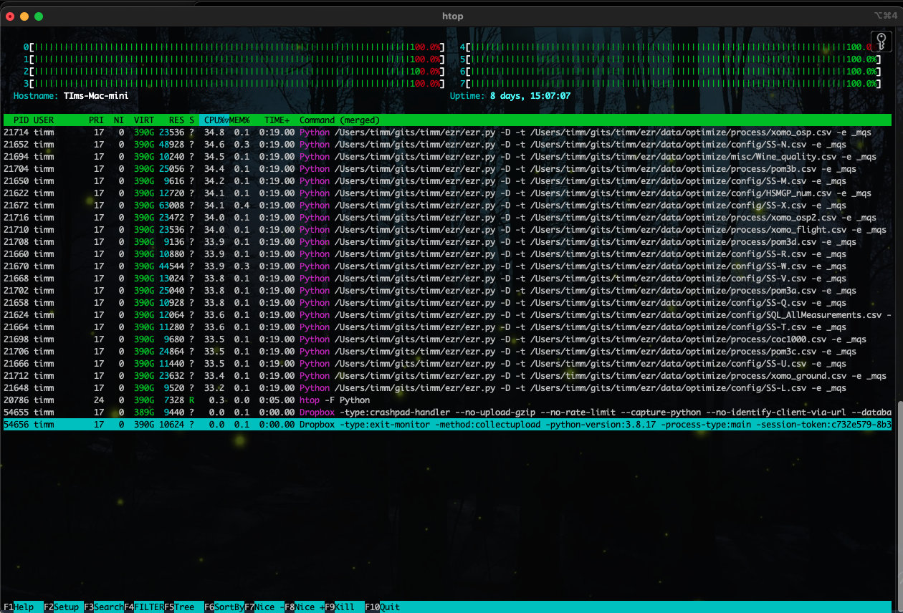

% Howework2

 

(Note: the following works for LINUX and Mac. Windows users, please join in a disucssion at
[windows](https://discord.com/channels/1274561111420702720/1276992727761817611]
1. Update your code from http://github.com

2. Install the htop monitor so you can track executions (Windows users many have an equivalent tool).

3. Run all our models. The following code auto-generated a file $(Tmp)/acts.sh. Note that by editing this file and running "sh acts.sh" you
can rerun all the experiments.

    make acts

4. Monitor with "htop -F Python" or some equivalent.

After 30 minutes, do you have any nasty models still running? If yes, then kill those processes and do not use them in the following.
After killing, look at the tail of files in $(Tmp)/mqs. Does the last line look funny (i.e. a killed process did not complete writing that line?).
If yes, delete that file.

5.  Based on the 
[extension](https://txt.github.io/se24fall/03code.html#try-it-for-yourself) you ran last time, there are nine groups of files
with small, medium and high dimensionality and small, medium, high number of rows. Run the summary stats function to see if different
conclusions hold for different groups. For example (and you will need to modify this example):

    cd erz/etc
    bash rq.sh ~/tmp/mqs/SS*.csv # just summarize the  results from the SS-*.csv files

- remember to use the 24Aug14 branch
- see examples [here](https://txt.github.io/se24fall/03code.html#try-it-for-yourself)
- note that data divides into small,medium, high dimensionality  (number of x columns) and 
  size (number of rows)

    make 
How many of our models do not complete

Install Python 31.3

- for [linux](https://txt.github.io/se24fall/03code.html#get-python3.13)
- for [mac](https://www.python.org/downloads/macos/)
- for windows: when you work it out, tell the class

Get the extension [extension](https://txt.github.io/se24fall/03code.html#try-it-for-yourself) going

- remember to use the 24Aug14 branch
- see examples [here](https://txt.github.io/se24fall/03code.html#try-it-for-yourself)
- note that data divides into small,medium, high dimensionality  (number of x columns) and 
  size (number of rows)

Here is a command line that runs all the current built-in examples. Please run it

    python3 -B ezr.py -D -e all -t data/optimize/misc/auto93.csv > ~/tmp/out

Run this code and answer the following questions. Write short answers for each. Submit one set of answers per team.

1. **heavens** d2h is short for "distance to heaven". How is it calculated?
2. **chebys** : how is the cheyshev distance different to d2h?
2. **likings**
   - in english, explain how loglike is calculated? and how is that calculation different for numeric and symbolic columns?
   - Diversity sampling means that the next thing we look out should be different to everything seen before. So explain: "selecting for min loglike is a synonym for diversity sampling"
3. **mean-vs-median**
   - This code recursively divides data by (a) slitting data according to everyone's distance to two far points; then (b) recursing into each half.
   - What is the difference between `half_median` and `half_mean`?
   - Referring to `~/tmp/out`a: in auto93.csv, does mean or median splits make a difference?
4. **clusters** shows the results of a tree generated via mean splits, How would this tree be different if we used median splits?
5. **clusters2** shows the results of prediction by (a) cluster the data (see **clusters**) then for each test (b) find its nearest leaf cluster; 
   then (c) using either the median value of that leaf or the 1,2,3,5 nearest neighbor. Based on these results, what approach would you recommend?

