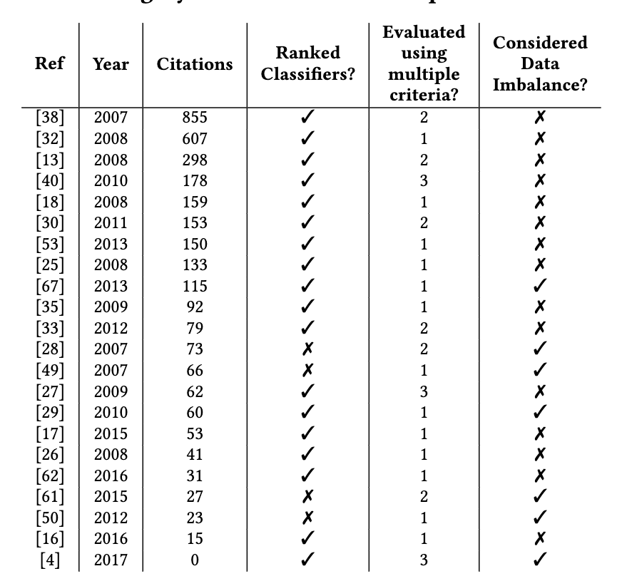
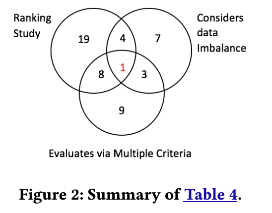

% Project0: Motivation,  Lit Review, Methods

To Deliver: the first 3-4 pages of a paper

Example: [https://arxiv.org/pdf/1705.03697](https://arxiv.org/pdf/1705.03697).

- The "Stanford model" introduction
  - para1: Everyone does X
  - para2: But X has a problem
  - para3: We have this new idea/insight based on Y
  - para4: So for the rest of this paper we will try Z
  - then, some lists
    - resaerch questions (things your check)
    - contributions (here, you will have to make stuff up)
- Related Work
- Descriptions of algorithms, success measures, statistical methods
- Your proposed new idea.

A constant problem in defect prediction is what classifier should
be applied to build the defect predictors? To address this problem,
many researchers run ranking studies where performance scores
are collected from many classifiers executed on many software
defect data sets.

This section assesses those ranking studies. We will say a ranking
study is “good” if it compares multiple learners using multiple data
sets and multiple evaluation criteria while at the same time doing
something to address the data imbalance problem.

In July 2017, we searched
scholar.google.com for
the conjunction of “software” and “defect prediction” and “OO” and “CK”
published in the last
decade. This returned
231 results. We only selected OO and CK keywords since CK metrics
are more popular and
better than process metrics for software defect prediction [ 53]. From that list, we selected
“highly-cited” papers, which we defined as having more than 10
citations per year. This reduced our population of papers down
to 107. After reading the titles and abstracts of those papers, and
skimming the contents of the potentially interesting papers, we
found 22 papers of Table 4 that either performed ranking studies
(as defined above) or studied the effects of class imbalance on defect
prediction. In the column “evaluated using multiple criteria”, papers
scored more than “1” if they used multiple performance scores of
the kind listed at the end of Section 2.2.

We find that, in those 22 papers from Table 4, numerous classifiers have used AUC as the measure to evaluate the software defect
predictor studies. We also found that majority of papers (from last
column of Table 4, 6/7=85%) in SE community has used SMOTE to
fix the data imbalance. This also made us to
propose SMOTUNED. As noted in, no single classification
technique always dominates. That said, Table IX of a recent study
by Ghotra et al.  ranks numerous classifiers using data similar
to what we use here (i.e., OO JAVA systems described using CK
metrics). Using their work, we can select a range of classifiers for
this study ranking from “best” to “worst’: see Table 3.

The key observation to be made from this survey is that, as
shown in Figure 2, the overwhelming majority of prior papers in
our sample do not satisfy our definition of a “good” project (the sole
exception is the recent Bennin et al. [ 4] which we explore in RQ4).
Accordingly, the rest of this paper defines and executes a “good”
ranking study, with an additional unique feature of an auto-tuning
version of SMOTE.

A literaeture review should respect and disrespect the past

- Show the reader you know the past;
- Show the reader, why you need to do something new.
- And there should be some  throw to the rest of this paper; e.g.

> In summary, prior work suffered from: (1) Some methods only find
bias, without trying to fix it; (2) Some methods for fixing bias
have an undesired side effect: leaner performance was degraded.
For the rest of this paper, we explore a solution that finds root
causes of bias, and directly implement mitigation of those causes
(resulting in less bias and better performance than seen in prior
work).

Run a query in [Google Scholar](https://scholar.google.com)

- e.g "active learning" "software engineering"

Sort down the citation counts on the first 10 pages (100 numbers). Find the "elbow" (the inflection point is the point
furthest from the line drawn min to max, e.g. see "X", below).

      | o.
      |  o  . 
      |        .
      |   0       .
      |             / '  
      |      o     /       .
      |           X            .
      |                 o            .      
      |                        o     o
      |                                
      .-------------------------------------

Skim all papers above the inflection point. Look for 3 to 6 common themes. This takes us to
  

