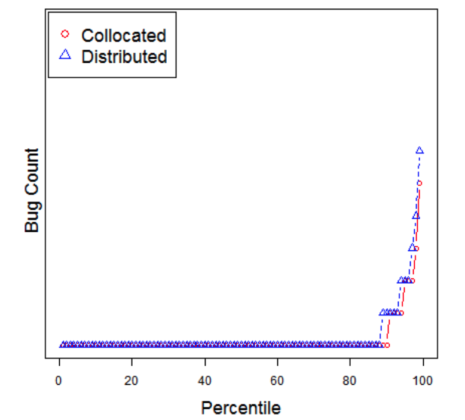
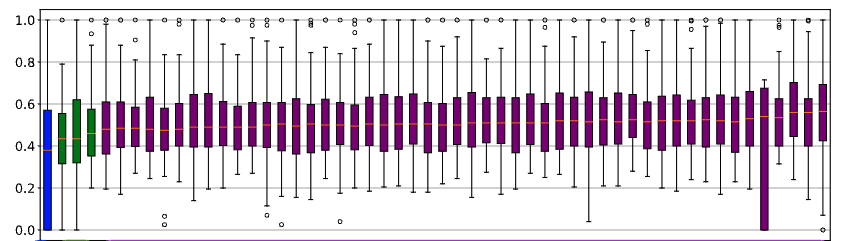

% stats

<br clear=all>

## Tl;DR


Find [stats.py](https://github.com/timm/ezr/blob/24Aug14/stats.py)

Run `python3.13 stats.py`.

Collect your Nobel prize.

## Does 42==44?

If we watched 100 women and men walk past us and their mean walking tipped was 42 and 44 cm/second (for men and women respectively), it is true that men walk faster than women?

This is an example of the problem of comparing samples. Which can get tricky.


These problem as two parts:

- Are the samples distinguishable?
  - If we picked a number from one sample, can we tell of it can be found on the other?
  - This is the (badly named) singificance test.
- Is the difference between them non-trivial:
  - This is the effect size test
  - And we want to ignore small effects.


SE example:



- Consider software built by teams who are either (a) located in the same site or (b) distributed around the globe.
i- Distributed development is infamous for lower quality due to geographical
dispersion  which raises issues of communication,
and problems building mutual confidence among distributed
teams.
- However, in 2009, Bird et al. [^bird] checked for those
effects in distributed Microsoft projects.
  - They found that
    management can successful mitigate for these detrimental
    effects (team members need to be organized along product
    lines and not on their geographical location).
- But in 2013, Kocaguneli et al. [^ekrem] reported a statistically significant effect (a decrease) in the quality of software generated by Microsoft's distributed development team (compared to developers who worked locally together).
  - However, they could that the difference in quality was a "small effect"; i.e. neglicable
  - i.e. it was not irresponsible for Microsoft to continue on with distributed development.

Note that the above needed precise definitions for _statistically significant effect_ and _small effect size_. How to find those?


[^bird]: C. Bird, N. Nagappan, P. T. Devanbu, H. Gall, and B. Murphy. Does
distributed development affect software quality? an empirical case study
of windows vista. In ICSE, pages 518–528, 2009.

[^ekrem]: Kocaguneli, E., Zimmermann, T., Bird, C., Nagappan, N., & Menzies, T. (2013, May). Distributed development considered harmful?. In 2013 35th International Conference on Software Engineering (ICSE) (pp. 882-890). IEEE.

## Easy Case: means far away and the curves do not overlap

- So the curves are significantly different
- with large effect


Now we increase the standard deviation.

- So much overalp. Curves may not be significantly different
- And now that mean seperation seems less different


## Terminology

We _sample_ under different _treatments_ (e.g. we put weights on our people, then ask them to walk around)

- and the _sample size_ is the number of measurements made per _treatment_.

Sometimes we assume _samples_ come from different _distributions_ (e.g. normal, binomial, etc).

We want to know how to separate _samples_ that are _significty distinguisable_, by more than a _small effect size_.

## Parametric Statistical Tests

If we assume that our data comes from a certain distrubtion then we could write a formula to compute the overlap or, if we throw darts at both diistributions, waht are the odds
that we will hit numbers from one distribution, not aother.

This is called parametric statisitics. You assume a formula (e.g. Gaussian) then look to filling in the parameters of that distribution (for Gaussian, the mean $\mu$ and the standard deviation $\sigma$ ).

But there are so many distributions so it is not clear what formula we should use.


Also, real world data may be conform to a simple single distribution. For exam,e here are the query times for 50 SQL statements in one program.


If you want a justification for parametric tests:

- To select  a "best” methods, apply the advice of Rosenthal et al. [46] 
  - Rosenthal, R., Cooper, H., Hedges, L.: Parametric measures of effect size. The handbook of research synthesis 621(2), 231–244 (1994). 3350 citations.
  - Consider results that are bounded 0..1. Such  results are not prone to extreme outlier effects (such extreme outliers are indicators for long-tail effects which, in turn 
      suggest that it might be better to use non-parametric methods).
  - Assuming no extreme outliers, non-parametric tests have less statistical power than parametric ones. 
  - Rosenthal et al. discuss different parametric methods for asserting that one result is with some small effect of another (i.e. it is “close to”). 
  - They list dozens of effect size tests that divide into two groups: 
    - the "r" group that is based on the Pearson correlation coefficient; 
    - or the d family that is based on absolute differences normalized by (e.g.) the size of the standard deviation. 
  - Rosenthal et al. comment that “none is intrinsically better than the other”. 
  - Here, use the most direct parametric methods. 
    -  Using a "d" family method, it can be concluded that one distribution is the same as another if their mean value differs by less than Cohen’s delta (d*standard deviation). 
        Note that d is computed separately for each different evaluation measure (recall, false alarm, AUC). To visualize that “close to” analysis, in all our results:– 
        Any cell that is within d of the best value will be highlighted in gray. All gray cells are observed as “winners” and all the other cells are “losers”.– 
        For recall and AUC, the “best” cells have “highest value” since the optimization goal is to maximize these values.– For false alarm, the “best” cells have “lowest value” since 
        false alarms is to be minimized. 
    - As to what value of d to use in this analysis, we take the advice of a widely cited paper by Sawilowsky [47] (this 2009 paper has 3470 citations). 
      - Sawilowsky, S.S.: New effect size rules of thumb. Journal of Modern Applied Statistical Methods 8(2), 26 (2009)
      - That paper asserts that “small” and “medium” effects can be measured using d = 0.2 and d = 0.5 (respectively). 
      - Splitting the difference, we will analyze this data looking for differences larger than d = (0.5 + 0.2)/2 = 0.35.

Warning: I don't buy the above except for making  approx arguments about the value of X vs Y. So I might use "d= 0.35"  to dispense with tiny differences in results.


## Non-parametric stats

### Scott-Knott:

Many statistical methods (e.g.  t-test, Tukey, Duncan, Newman-Keuls procedures) suffer from  have overlapping
problems.
- By overlapping we mean the possibility of one or more sample to be classified in
more than one group.
- In fact, as the number of samples increase, so to does the the number of overlaps, which makes it hard  to
    distinguish the real groups to which the means should belong.
- The Scott-Knott method [^sk] does not have this problem, what is often cited as a very good quality of this
procedure.

Scott-Kott is a recursive clustering procedure that
- sorts the samples
- divided them on the largest expected difference in the mean before and after division
- then recuses on each half, but only if the two halfs are statistically different

The halves are picked to maximize:

$$    E(\Delta) = \frac{|l_1|}{|l|}abs(E({l_1}) - E({l}))^2 + \frac{|l_2|}{|l|}abs(E({l_2}) - E({l}))^2$$

(here   $|l_1|$ means the size of list $l_1$)


[^sk]: Scott R.J., Knott M. 1974. A cluster analysis method for grouping mans in the analysis of variance.
Biometrics, 30, 507-512.

For example, support I had four samples labelled _x1,x2..._ etc

```python
def some1(n=5):
  report([ SOME([0.34, 0.49 ,0.51, 0.6]*n,   txt="x1"),
        SOME([0.6  ,0.7 , 0.8 , 0.89]*n,  txt="x2"),
        SOME([0.09 ,0.22, 0.28 , 0.5]*n, txt="x3"),
        SOME([0.6  ,0.7,  0.8 , 0.9]*n,   txt="x4"),
        SOME([0.1  ,0.2,  0.3 , 0.4]*n,   txt="x5")])

some1()
```
I would sort them by their median value the draw a little box plot of their 10-to-30th values, their median, and their 70-to-90th value:

```
#
 0, x3,  0.28,  0.06, ------   *----------|                   
 0, x5,  0.30,  0.10, -----     *----     |                   
#
 1, x1,  0.51,  0.02,             ------- *----               
#
 2, x2,  0.80,  0.10,                     |    -----     *--- 
 2, x4,  0.80,  0.10,                     |    -----     *--- 
```

Note the left-handside `sk rank` column. This reports what happens after SK sorts the samples and decides which ones are different

- A treatment has the same ranked the one before it,
  - it is not statistically distinguishable
  - by more than small effect.

But how does it do it? The Scott & Knott method make use of a top-down clustering algorithm, where, starting from
the the whole group of observed mean effects, it divides, and keep dividing the sub-groups in such
a way that the intersection of any two groups formed in that manner is empty.

This means that $N$ samples might  get ranked using    only $\log_2(N)$ statistical comparisons
- and even less, if ever sub-trees high up int the process are found to be not statistically different
- Also, Scott-Knott converts the  problem of ranking samples to clustering probkem (which I do understand) rather than a stats problem (which, in all fairness, I understand only weakly).


```python
def sk(somes,epsilon=0.01):
  "Sort nums on mid. give adjacent nums the same rank if they are statistically the same"
  def sk1(somes, rank, cut=None):
    most, b4 = -1, SOME(somes)
    for j in range(1,len(somes)):
      lhs = SOME(somes[:j])
      rhs = SOME(somes[j:])
      tmp = (lhs.n*abs(lhs.mid() - b4.mid()) + rhs.n*abs(rhs.mid() - b4.mid())) / b4.n
      if tmp > most and (somes[j].mid() - somes[j-1].mid()) > epsilon:
         most,cut = tmp,j
    if cut:
      some1,some2 = SOME(somes[:cut]), SOME(somes[cut:])
      if True: #not some1.cohen(some2): # and abs(some1.div() - some2.div()) > 0.0001:
        if some1 != some2:
          rank = sk1(somes[:cut], rank) + 1
          rank = sk1(somes[cut:], rank)
          return rank
    for some in somes: some.rank = rank
    return rank
  somes = sorted(somes, key=lambda some: some.mid()) #lambda some : some.mid())
  sk1(somes,0)
  return somes
```

Note the commented out call to `some1.cohen(some2)`.

```python3
def cohen(i,j):
      return abs( i.mid() - j.mid() ) < the.stats.cohen * i.pooledSd(j)

def pooledSd(i,j):
   "Return a measure of the combined standard deviation."
   sd1, sd2 = i.div(), j.div()
   return (((i.n - 1)*sd1 * sd1 + (j.n-1)*sd2 * sd2) / (i.n + j.n-2))**.5
```

## Not Equal

But how to code up `!=`?. Recall that this needs two functions

- Are the sample distinguishable?
  - If we picked a number from one sample, can we tell of it can be found on the other?
- Is the difference more than a small effect?
  - This is the effect size test

```python
  def __eq__(i:SOME, j:SOME) -> bool:
      "True if all of cohen/cliffs/bootstrap say you are the same."
      return  i.cliffs(j) and i.bootstrap(j) ## ordered slowest to fastest
```
Note that that this is a conjuction; i.e. to prove "different" I have to prove both things.

### CliffsDelta (non-parametric effect size)

This code is simple. For everything $x$ in one sample, look in the other sample
- Count how often there are bigger and larger numbers in the other sample.
- If $x$ has many numbers less and greater than me, then I tend to be the same as the other sample
  - Since I tend to fall to the middle of the other sample

```python
  def cliffs(i:SOME, j:SOME , dull=None):
      """non-parametric effect size. threshold is border between small=.11 and medium=.28
      from Table1 of  https://doi.org/10.3102/10769986025002101"""
      n,lt,gt = 0,0,0
      for x1 in i.has():
        for y1 in j.has():
          n += 1
          if x1 > y1: gt += 1
          if x1 < y1: lt += 1
      return abs(lt - gt)/n  < (dull or the.stats.cliffs or 0.197)
```

### Bootstrap (non-parametric test for "distinguish-ablity")

- Summarize the difference in   two samples with some `obs` (observartion)
- Hundreds of times
  - Sample with replacement from both samples
  - Count how often the observation is larger than the baseline `obs`.
- The higher that count, the harder it is to seperate you
  - so the lower that count, the more we are sure you are different.

Here's the code for that. `yhat` and `zhat` are transforms recommended by
 Efron and Tibshirani to level the playing field (ensures that both distribution s
 are scored on mean value that is common to both distributions).

```python
  def  bootstrap(i:SOME, j:SOME,confidence=None,bootstraps=None):
      """non-parametric significance test From Introduction to Bootstrap, 
        Efron and Tibshirani, 1993, chapter 20. https://doi.org/10.1201/9780429246593"""
      y0,z0  = i.has(), j.has()
      x,y,z  = SOME(inits=y0+z0), SOME(inits=y0), SOME(inits=z0)
      delta0 = y.delta(z)
      yhat   = [y1 - y.mid() + x.mid() for y1 in y0]
      zhat   = [z1 - z.mid() + x.mid() for z1 in z0] 
      pull   = lambda l:SOME(random.choices(l, k=len(l))) 
      samples= bootstraps or the.stats.bootstraps or 512
      n      = sum(pull(yhat).delta(pull(zhat)) > delta0  for _ in range(samples)) 
      return n / samples >= (confidence or the.stats.confidence or 0.05)
 ```

## Things to Note

### Blurring


“The point was that you have to look at the world as it is, not as some elegant theory says it ought to be.”
— M. Mitchell Waldrop



When dealing with many treatments with larte variance,

- results may "_blur_"
- i.e. many of them are statistically indistinguishable.

For example, at left,  51 of the 55
treatments all receive the same rank.

When such blurring occurs,

- we can conclude is that some of the distinctions made during sampling were unimportant
  (in the sense that it does not distinguish the individual treatments).
- Which can lead to some startling results....


For another example, consider [knn results](https://github.com/timm/lean/blob/master/src/knn.lua) that scores nearest-neighbor regression
using $100*(predicted-actual)/predicted$

- Using $k \in \{1,2,4,8}$ nearest neighbors
- Via  training set that contains $N \in \{512,256,128,32\}$  rows selected at random from auto.csv
- Using a distance function $p \in \{1,2,4,8\}$  for $(\sum_i (x_i-y_i)^p)^{1/p}$ (and recall that $p=2$ is Euclidean)
- Where the conclusions of those near neighbors are combined via a  median or  triangular kernel function
  - median means "pick the middle value"
  - triangular means "closer values are weighted more"

$$ \mathit{prediction}= \frac{\sum_i n_i/d_i}{\sum_i 1/d_i} $$

Please consider $(k=4,p=4, N=32, f=\mathit{triangle})$. Notice anything interesting?
###  Runtimes and Storage

Parametric stats are very fast and consume little memory (jsut the memory required for the params).

Non-parametric stats are slower (see all that sampling inside `_bootstrap` and that $O(N^2)$ traversal inside `cliffsDelta`).
So don't run non-parametric tests inside the inner-most loop of your reasonong.

If you need a quick and dirty check for differences, just check if the mean difference is larger than a third of the standard deviation of the sample. No, this test is not well-founded. But it is useful
as a heuristic.

Then,  once you have  collected results from (say) 20 repeated runs, run these non-parametric tests as part of your final report generation.

### Statistical Wars

So much discussion of "what stats is best". Very little experimentation on data.

here,s we asking cfliffsDelta (cd), boostrapping (boot), conjuction of both, and sd/3 if two sample are different wjere

- sample1 is 20  numbers from a gaussian (mean=10, sd=3)
- sample2 is just $x_i * \mathit{inc}$

Note the large areas of agreement, with a small dispute zone in the middle.

|inc  |cd  |boot  |c+b  |sd/3|dispute?|
|---|---|---|--|--|:--:|
|1 |False |False |False |False||
|1.02 |False |False |False |False||
|1.04 |False |False |False |False||
|1.061 |False |False |False |False||
|1.082 |False |False |False |False||
|1.104 |True |False |False |False|n|
|1.126 |False |False |False |True|n|
|1.149 |True |False |False |True|n|
|1.172 |True |False |False |True|n|
|1.195 |True |False |False |True|n|
|1.219 |True |True |True |True||
|1.243 |True |False |False |True|n|
|1.268 |True |True |True |True||
|1.294 |True |True |True |True||
|1.319 |True |True |True |True||
|1.346 |True |True |True |True||
|1.373 |True |True |True |True||
|1.4 |True |True |True |True||
|1.428 |True |True |True |True||
|1.457 |True |True |True |True||
|1.486 |True |True |True |True||

